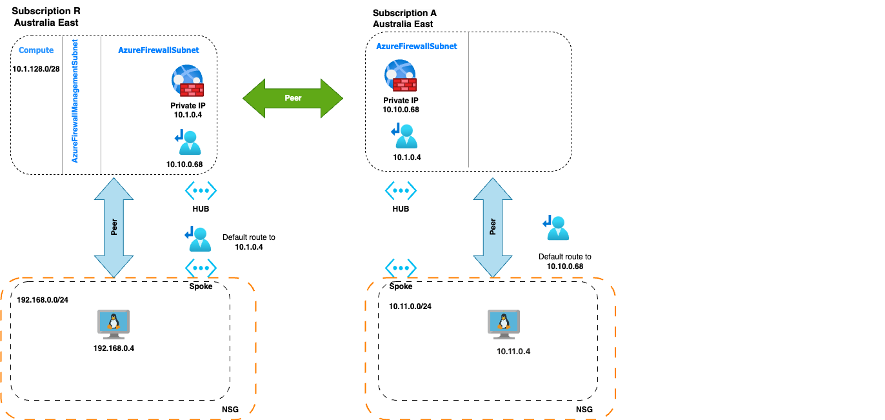
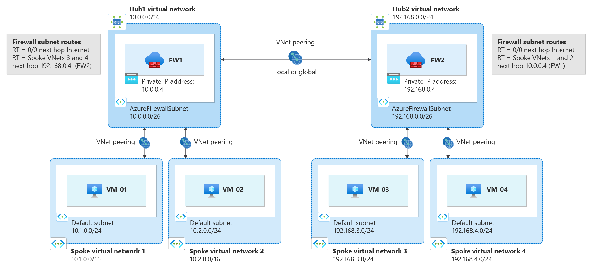

**Azure HUB(spoke)<->HUB(spoke)**

The Original (manual) setup:
Connecting two HUB(spoke)<->HUB((spoke) on two different subscriptions with 2 Azure firewalls on each side:

Each Subscription belonged to its own AzureAD (Entra)

Reference:
https://learn.microsoft.com/en-us/azure/firewall/firewall-multi-hub-spoke#baseline-architecture

**Note**: 

**Had to do the peering manually as the service principal althought having permissions didn't perform the action in TF. Documentation is not exactly long or detailed about it and almost everybody ran over the same issue. To be tested further in the future (TF Vnet peering). Move the networking code to the 'i' directory**

